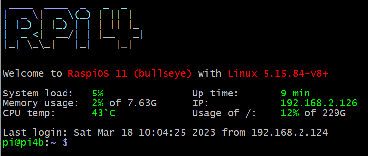

A pretty banner for the Raspberry Pi terminal window.




Install the prerequisites. Git and the block letter generator is required. Installl with:
```
sudo apt install toilet git
```
The clone the git repo with:
```
git clone https://github.com/lurk101/rpi-banner.git
```
Then install with:
```
cd rpi-banner/
sudo cp /etc/update-motd.d/10-uname /etc/update-motd.d/10-uname.bak # save a backup
sudo cp src/* /etc/update-motd.d/
```
That's it. Open a terminal window.
